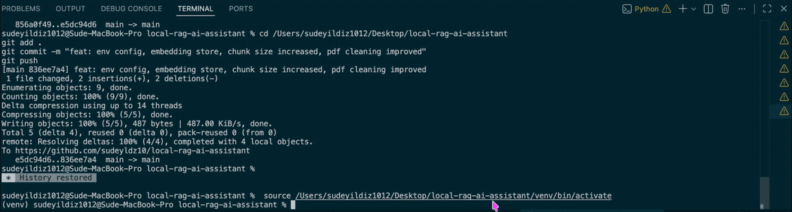

# Local RAG AI Assistant

An offline Retrieval-Augmented Generation (RAG) assistant built with Python and Microsoft Foundry Local — runs fully without internet or cloud APIs.

---

## Demo



---

## Features

- **Multi-format document loading** — supports `.txt`, `.pdf`, and `.docx` files
- **Recursive folder scanning** — automatically scans all subfolders for documents
- **Text chunking and preprocessing** — smart splitting with configurable chunk size and overlap
- **Embedding generation** — semantic vector representations via Foundry Local SDK
- **Embedding persistence** — embeddings saved to SQLite database, no recalculation on restart
- **Semantic similarity search** — finds the most relevant chunks for each query
- **Retrieval-Augmented Generation (RAG)** — grounds LLM answers in your documents
- **Conversation history** — remembers previous questions within a session
- **Source filtering** — use `[foldername]` tag to search only within a specific folder
- **Environment-based config** — document path set via `.env`, no hardcoded paths
- **Local LLM integration** — via Microsoft Foundry Local SDK, no cloud required
- **Modular project architecture** — clean separation of ingestion, retrieval, and generation
- **Fully offline workflow** — your data never leaves your machine

---

## Technologies Used

| Tool | Purpose |
|------|---------|
| Python | Core language |
| Microsoft Foundry Local SDK | Local LLM inference and embedding generation |
| SQLite | Local vector storage (via built-in sqlite3) |
| PyMuPDF (fitz) | PDF parsing |
| python-docx | DOCX parsing |
| NumPy | Cosine similarity computation |
| python-dotenv | Environment variable management |

---

## Project Structure

```
local-rag-ai-assistant/
│
├── app/
│   ├── ingestion/
│   │   ├── document_loader.py     # TXT, PDF, DOCX loading with folder recursion
│   │   ├── text_splitter.py       # Chunk splitting logic
│   │   ├── embedding_generator.py # Vector generation via Foundry Local
│   │   └── embedding_store.py     # Save/load embeddings to SQLite
│   │
│   ├── retrieval/
│   │   ├── vector_store.py        # Cosine similarity
│   │   └── retriever.py           # Top-k semantic search
│   │
│   ├── llm/
│   │   ├── local_llm.py           # Foundry Local initialization
│   │   └── prompt_templates.py    # System prompt builder
│   │
│   ├── utils/
│   │   └── helpers.py             # Answer cleaning
│   │
│   ├── rag_pipeline.py            # End-to-end RAG logic
│   └── main.py                    # Entry point
│
├── data/                          # Default document folder
├── vector/                        # embeddings.db stored here (auto-generated)
├── requirements.txt
├── .env                           # Set DOCS_PATH here
└── .env.example
```

---

## How It Works

```
Your Documents (TXT / PDF / DOCX)
        │
        ▼
  [ Document Loader ]  →  recursive folder scan
        │
        ▼
  [ Text Splitter ]  →  overlapping chunks
        │
        ▼
  [ Embedding Generator ]  →  vectors via Foundry Local
        │
        ▼
  [ Embedding Store ]  →  saved to vector/embeddings.db (SQLite)
        │
   User Query
        │
        ▼
  [ Retriever ]  →  top-k relevant chunks (with optional source filter)
        │
        ▼
  [ LLM (Foundry Local) ]
        │
        ▼
     Answer ✓
```

---

## Installation

```bash
git clone https://github.com/sudeyldz10/local-rag-ai-assistant.git
cd local-rag-ai-assistant
pip install -r requirements.txt
```

Set your documents folder in `.env`:
```
DOCS_PATH=/path/to/your/documents
```

Run the assistant:
```bash
python app/main.py
```

---

## Usage

**Basic question:**
```
Question > What is the Mean Value Theorem?
```

**Filter by folder:**
```
Question > [math210] implicit function theorem nedir?
```

Only documents inside the `math210` folder will be searched.

---

## What I Learned

Building this project gave me hands-on experience with:

- RAG architecture and how retrieval improves LLM accuracy
- Working with vector embeddings and cosine similarity search
- Parsing multiple document formats (TXT, PDF, DOCX) in Python
- Integrating a local LLM through the Microsoft Foundry Local SDK
- Designing a modular, layered Python project from scratch
- Debugging import errors, module structure issues, and model initialization
- Building a fully offline AI system with zero external API calls
- Storing and querying structured data with SQLite

---

## Challenges I Faced

- Handling different document encodings and formats consistently
- Getting the Foundry Local SDK initialized correctly
- Tuning chunk size and overlap for better retrieval quality
- Structuring the project so each module stays independent and testable
- Suppressing `<think>` reasoning tokens from model output using regex
- Scanned PDFs returning only `\n` characters — solved with a minimum content length filter
- Unrelated documents scoring high in retrieval — solved with source filtering by folder tag
- Large embedding models (8b) being too slow for local use — reverted to 0.6b

---

## Future Improvements

- Streaming responses in real time
- Desktop GUI interface (Gradio)
- Better retrieval ranking (hybrid search: BM25 + semantic)
- Re-ranking with a cross-encoder model
- Support for more formats (Markdown, HTML, CSV)

---

## Example Use Cases

- Ask questions about your lecture notes and textbooks
- Build a private, offline knowledge base from your own documents
- Summarize long documents without sending data to the cloud
- Filter searches by subject folder for more precise answers

---

## License

This project is currently under active development and is shared for evaluation and educational purposes only.
