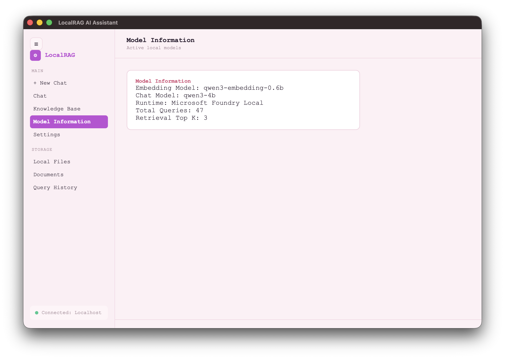
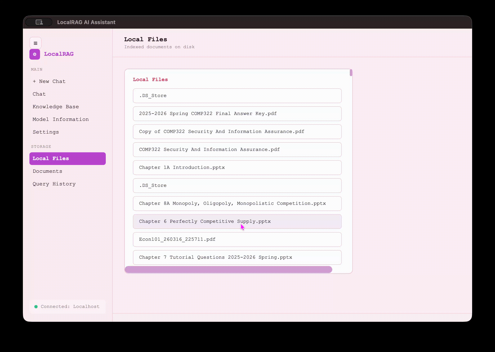
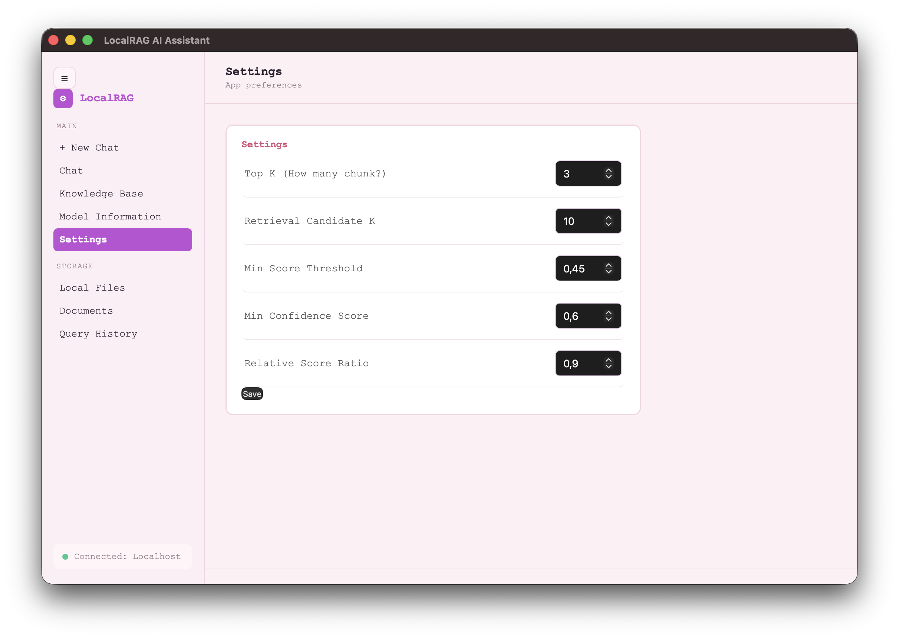
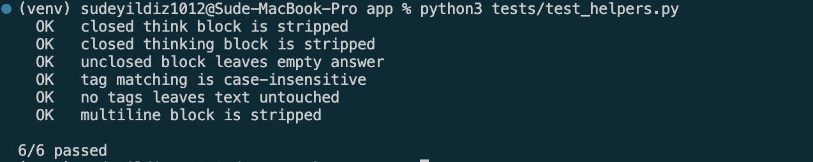
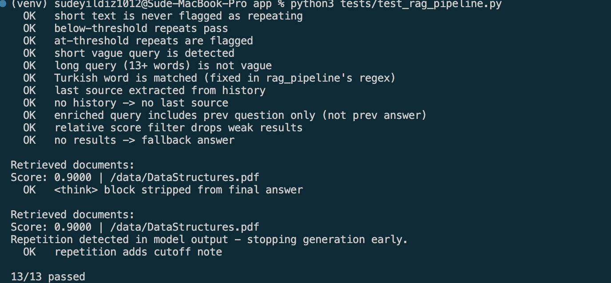
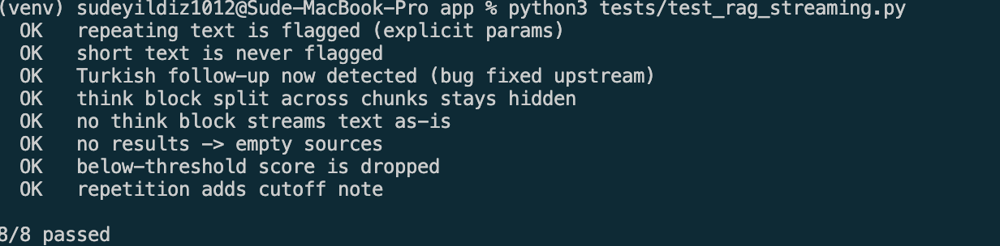
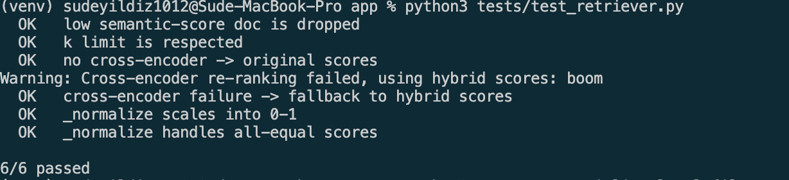
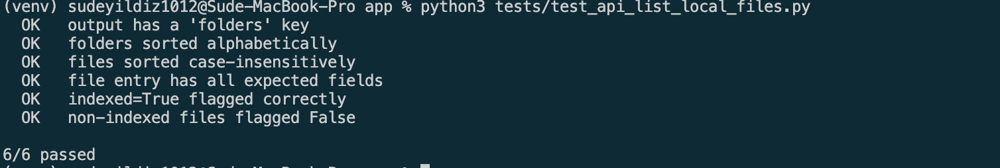

# Local RAG AI Assistant

An offline Retrieval-Augmented Generation (RAG) assistant built with Python and Microsoft Foundry Local — runs fully without internet or cloud APIs. Includes a native desktop UI built with pywebview.

---

## Demo


---

## Screenshots

**Model Information**


**Local Files**


**Documents**


**Settings**


**Query History**


---

## Features

- **Desktop UI** — native app window built with pywebview (chat, knowledge base dashboard, model info, settings)
- **Multi-format document loading** — supports `.txt`, `.pdf`, `.docx`, `.md`, `.pptx`, `.xlsx`, and image files (`.jpg`, `.jpeg`, `.png`)
- **Recursive folder scanning** — automatically scans all subfolders for documents
- **Text chunking and preprocessing** — smart splitting with configurable chunk size and overlap
- **Embedding generation** — semantic vector representations via Foundry Local SDK
- **Embedding persistence** — embeddings saved to SQLite database, no recalculation on restart
- **Hybrid retrieval (BM25 + semantic)** — combines lexical (BM25) and semantic (cosine similarity) scoring for stronger retrieval than either alone
- **Cross-encoder re-ranking** — optionally re-ranks the hybrid candidates with a cross-encoder model for a final relevance boost
- **Semantic similarity search** — finds the most relevant chunks for each query
- **Smart retrieval pipeline** — candidate pre-filtering, absolute score threshold, relative score filtering, and source preference for follow-up queries
- **Retrieval-Augmented Generation (RAG)** — grounds LLM answers in your documents
- **Persistent multi-chat history** — every conversation is saved to its own SQLite record and can be reopened from the sidebar's Query History
- **Conversation history** — remembers previous questions within a chat; follow-up queries are automatically enriched with prior context (Turkish and English follow-up phrasing both recognized)
- **Confidence-based early exit** — if retrieved chunks fall below the confidence threshold, the LLM is skipped and a clear "not enough info" message is returned instead
- **Streaming responses** — answers stream token-by-token in real time, with `<think>` reasoning blocks held back until they close
- **Source filtering** — use `[foldername]` tag to search only within a specific folder
- **Source-cited answers** — every document-based answer references the exact source file used
- **Math rendering** — LaTeX-style expressions rendered as real formulas in the UI (via MathJax)
- **Diagram rendering** — on request, the assistant can generate simple network/flow diagrams (via Mermaid)
- **Environment-based config** — document path set via `.env`, no hardcoded paths
- **Local LLM integration** — via Microsoft Foundry Local SDK, no cloud required
- **`<think>` token suppression** — Qwen model internal reasoning is stripped from output, including cases where the model gets cut off mid-reasoning without a closing tag
- **Repetition-loop safeguard** — detects when the model falls into a repetitive output loop and stops generation early instead of flooding the chat
- **Incremental re-sync** — re-syncing only embeds newly added files instead of reprocessing the entire knowledge base from scratch
- **Model Information panel** — view the active embedding/chat model names, runtime, total query count, and current retrieval top-k at a glance
- **Local Files browser** — see every file currently scanned from your documents folder
- **Documents panel** — per-file chunk counts, showing exactly how each source document was split during ingestion
- **In-app Settings panel** — adjust retrieval parameters (top-k, candidate-k, score thresholds, relative score ratio, hybrid weights, reranker toggle) directly from the UI, no need to edit `config.py` by hand
- **Modular project architecture** — clean separation of ingestion, retrieval, generation, and UI
- **Fully offline workflow** — your data never leaves your machine

---

## Technologies Used

| Tool | Purpose |
|------|---------|
| Python | Core language |
| pywebview | Native desktop UI shell |
| HTML / CSS / JavaScript | Frontend (chat, sidebar, dashboard) |
| MathJax | Rendering math expressions in chat |
| Mermaid.js | Rendering diagrams in chat |
| Microsoft Foundry Local SDK | Local LLM inference and embedding generation |
| SQLite | Local vector storage and chat history storage |
| PyMuPDF (fitz) | PDF parsing |
| python-docx | DOCX parsing |
| rank_bm25 | Lexical (BM25) retrieval scoring |
| sentence-transformers | Cross-encoder re-ranking |
| NumPy | Cosine similarity computation |
| python-dotenv | Environment variable management |

---

## Project Structure

```
local-rag-ai-assistant/
│
├── app/
│   ├── config.py                  # Central config (thresholds, chunk size, model names, hybrid/reranker settings)
│   ├── api.py                     # Api class: pywebview window, RAG init, chat & history management
│   ├── rag_pipeline.py            # End-to-end RAG logic with smart filtering
│   ├── rag_streaming.py           # Streaming variant of the RAG pipeline (token-by-token responses)
│   │
│   ├── ingestion/
│   │   ├── document_loader.py     # TXT, PDF, DOCX, MD, PPTX, XLSX, image loading with folder recursion
│   │   ├── text_splitter.py       # Chunk splitting logic
│   │   ├── embedding_generator.py # Vector generation via Foundry Local
│   │   └── embedding_store.py     # Save/load embeddings to SQLite
│   │
│   ├── retrieval/
│   │   ├── vector_store.py        # Cosine similarity
│   │   └── retriever.py           # Hybrid (BM25 + semantic) search with optional cross-encoder re-ranking
│   │
│   ├── llm/
│   │   ├── local_llm.py           # Foundry Local initialization
│   │   └── prompt_templates.py    # System prompt builder with conversation history
│   │
│   ├── utils/
│   │   └── helpers.py             # Answer cleaning, <think> suppression
│   │
│   └── tests/                     # Unit tests for the pure-logic parts of the pipeline (no LLM/embedding calls)
│       ├── _common.py             # Shared test helpers (fake chat/embedding clients, tiny test runner)
│       ├── test_helpers.py        # <think> tag stripping
│       ├── test_rag_pipeline.py   # Repetition detection, follow-up detection, ask_question
│       ├── test_rag_streaming.py  # Streaming think-block handling, min_score_threshold filtering
│       ├── test_retriever.py      # Hybrid scoring filters, cross-encoder fallback behavior
│       ├── test_api_list_local_files.py  # list_local_files() output format
│       └── run_all.py             # Runs every test file in sequence
│
├── frontend/
│   ├── index.html                 # Desktop UI: chat, sidebar, knowledge base, query history
│   └── main.css                   # App styling
│
├── data/                          # Default document folder
├── vector/
│   ├── embeddings.db              # Cached document embeddings (auto-generated)
│   └── chats.db                   # Persisted multi-chat history (auto-generated)
├── requirements.txt
├── .env                           # Set DOCS_PATH here
└── .env.example
```

---

## How It Works

```
Your Documents (TXT / PDF / DOCX / MD / PPTX / XLSX / Images)
        │
        ▼
  [ Document Loader ]  →  recursive folder scan
        │
        ▼
  [ Text Splitter ]  →  overlapping chunks
        │
        ▼
  [ Embedding Generator ]  →  vectors via Foundry Local
        │
        ▼
  [ Embedding Store ]  →  saved to vector/embeddings.db (SQLite)
        │
   User Query (via desktop UI)
        │
        ▼
  [ Query Enrichment ]  →  follow-up queries enriched with conversation history
        │
        ▼
  [ Hybrid Retriever ]  →  BM25 + semantic cosine similarity, top candidate pool
        │
        ▼
  [ Cross-Encoder Re-ranking ]  →  optional final re-rank of the candidate pool
        │
        ▼
  [ Score Filtering ]
    ├─ Absolute threshold  (min_score_threshold)
    └─ Relative filter     (drops chunks far below best score)
        │
        ▼
  [ Confidence Check ]  →  if score < min_confidence_score, skip LLM and return early message
        │
        ▼
  [ LLM (Foundry Local) ]  →  streamed token-by-token
        │
        ▼
  [ <think> suppression ]  →  strips internal reasoning from Qwen output
        │
        ▼
  [ Math / Diagram Rendering ]  →  MathJax and Mermaid render formulas and diagrams in the UI
        │
        ▼
     Answer + Source Citation  →  saved to vector/chats.db ✓
```

---

## Configuration (`app/config.py`)

| Parameter | Value | Description |
|---|---|---|
| `top_k` | `3` | Number of chunks passed to the LLM as final context |
| `retrieval_candidate_k` | `10` | Initial candidate pool size before filtering |
| `min_score_threshold` | `0.55` | Absolute minimum — chunks below this are discarded |
| `min_confidence_score` | `0.60` | If top score is below this on ambiguous queries, LLM is not called |
| `relative_score_ratio` | `0.90` | Chunks scoring below 90% of the top result are dropped |
| `bm25_weight` | `0.5` | Weight given to the BM25 (lexical) score in the hybrid combination |
| `semantic_weight` | `0.5` | Weight given to the semantic (cosine) score in the hybrid combination |
| `enable_reranker` | `True` | Whether to apply cross-encoder re-ranking on top of hybrid retrieval |
| `cross_encoder_model` | `cross-encoder/qnli-distilroberta-base` | Model used for re-ranking |

All parameters can also be viewed and edited live from the **Settings** panel in the app — changes are written directly to `config.py` (restart required to take effect).

---

## Dashboard & Configuration

Beyond the chat window, the desktop app includes several panels:

| Panel | Purpose |
|-------|---------|
| **Knowledge Base** | Overview of indexed document counts by file type, with a re-sync button |
| **Model Information** | Active embedding/chat model names, runtime, total query count, retrieval top-k |
| **Local Files** | Lists every file currently scanned from the documents folder |
| **Documents** | Shows how many chunks each source file was split into |
| **Settings** | View and edit retrieval parameters without touching code |

---

## Installation

```bash
git clone https://github.com/sudeyldz10/local-rag-ai-assistant.git
cd local-rag-ai-assistant
pip install -r requirements.txt
```

Set your documents folder in `.env`:
```
DOCS_PATH=/path/to/your/documents
```

Run the assistant:
```bash
python app/api.py
```

The desktop app window will open automatically. On first launch, your documents will be loaded, chunked, and embedded — this may take a moment depending on how many files you have.

---

## Testing

Pure-logic parts of the pipeline (retrieval filtering, `<think>` tag cleanup, repetition detection, follow-up detection, file-listing format) are covered by a lightweight test suite that runs without any real LLM or embedding model calls — external calls are swapped out with fakes/mocks so the tests run instantly and deterministically.

Run the full suite:
```bash
cd app
python3 tests/run_all.py
```

Or run an individual file:
```bash
python3 tests/test_rag_pipeline.py
```

**Test Results**

`test_helpers.py` — `<think>` tag stripping


`test_rag_pipeline.py` — repetition detection, follow-up detection, `ask_question` end-to-end


`test_rag_streaming.py` — streamed `<think>` block handling, `min_score_threshold` filtering


`test_retriever.py` — hybrid score filtering, cross-encoder fallback behavior


`test_api_list_local_files.py` — `list_local_files()` output format


---

## Usage

Type your question directly into the chat input in the desktop app.

**Basic question:**
```
What is the Mean Value Theorem?
```

**Filter by folder:**
```
[math210] implicit function theorem nedir?
```

Only documents inside the `math210` folder will be searched.

**New chat:**
Click **+ New Chat** in the sidebar to start a fresh conversation. Previous chats remain saved and can be reopened from **Query History**.

**Diagrams:**
Ask the assistant to "draw" or "show a diagram" for topics like network topologies to get a rendered diagram instead of plain text.

---

## What I Learned

Building this project gave me hands-on experience with:

- RAG architecture and how retrieval improves LLM accuracy
- Working with vector embeddings and cosine similarity search
- Combining lexical (BM25) and semantic retrieval into a single hybrid score, and re-ranking with a cross-encoder
- Parsing multiple document formats (TXT, PDF, DOCX, MD, PPTX, XLSX, images) in Python
- Integrating a local LLM through the Microsoft Foundry Local SDK
- Designing a modular, layered Python project from scratch
- Building a native desktop UI with pywebview, connecting a Python backend to an HTML/CSS/JS frontend
- Debugging import errors, module structure issues, and model initialization
- Building a fully offline AI system with zero external API calls
- Storing and querying structured data with SQLite, including multi-chat history persistence
- Tuning retrieval quality with score thresholds and relative filtering strategies
- Making follow-up queries work correctly by enriching them with prior context, in both English and Turkish
- Prompt engineering for small local models: keeping instructions concise to avoid repetition and formatting drift
- Rendering math and diagrams in a chat UI with MathJax and Mermaid
- Wiring a multi-panel dashboard (model info, file browser, live settings editor) to a single Python backend through `pywebview`'s `js_api` bridge
- Writing dependency-free unit tests for pure logic by mocking out the LLM/embedding boundary

---

## Challenges I Faced

- Handling different document encodings and formats consistently
- Getting the Foundry Local SDK initialized correctly (`alias` vs `name` attribute)
- Tuning chunk size and overlap for better retrieval quality
- Structuring the project so each module stays independent and testable
- Suppressing `<think>` reasoning tokens from Qwen model output using regex
- Scanned PDFs returning only `\n` characters — solved with a minimum content length filter
- Unrelated documents scoring high in retrieval — solved with source filtering, a semantic-score floor, and the relative score filter
- Large embedding models (8b) being too slow for local use — reverted to `qwen3-embedding-0.6b`
- Preventing hallucination on vague queries — solved with confidence-based early exit before LLM call
- Follow-up queries losing context — solved by enriching queries with conversation history, in both English and Turkish
- Small local models breaking down into repetitive output when given overly long, detailed prompts — solved by simplifying the system prompt and detecting repetition mid-stream
- Race conditions between UI polling and backend initialization causing crashes — solved with defensive checks in the stats endpoint
- Rendering LaTeX and diagram syntax cleanly in a lightweight desktop UI without a heavy frontend framework
- Brute-force cosine similarity search becoming a bottleneck at scale — replaced the per-query Python loop with a vectorized NumPy operation, cutting retrieval time by ~99% on repeated queries
- App was re-generating embeddings for the entire document set on every startup, even when nothing had changed — fixed the existing-embeddings check so it actually skips re-embedding when `embeddings.db` already has up-to-date data, cutting startup time significantly
- Sidebar close button living inside the collapsible sidebar itself, making it impossible to reopen once closed — solved with a separate persistent open button outside the sidebar
- Knowledge base stat counters (PPTX/XLSX/PNG/JPEG) showing wrong numbers due to a DOM-order/array-index mismatch in the frontend
- Sidebar navigation breaking silently when a tab's `data-view` attribute didn't match its content container's `id` — fixed by cross-checking every nav link against its view container and adding a defensive fallback instead of a hard crash
- The model occasionally falling into an infinite repetition loop on complex prompts — solved by detecting repeated output mid-stream and stopping generation early
- Streaming a `<think>` block that could be split across multiple network chunks — solved by buffering until the closing tag is seen before deciding what to show


---

## Example Use Cases

- Ask questions about your lecture notes and textbooks
- Build a private, offline knowledge base from your own documents
- Summarize long documents without sending data to the cloud
- Filter searches by subject folder for more precise answers
- Keep separate, persistent chat threads for different courses or topics

---

## License

This project is currently under active development and is shared for evaluation and educational purposes only.